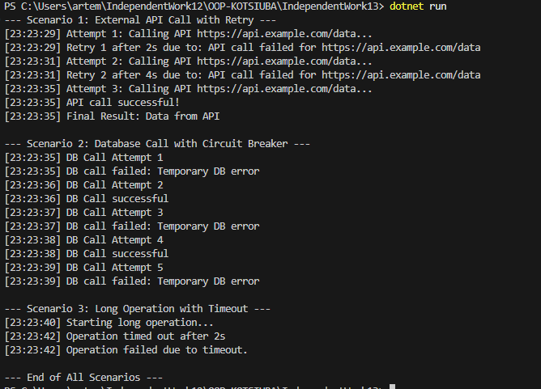

# IndependentWork13: Кейси Polly/Retry/Timeout/Circuit Breaker

## Скриншот запуску програми
!

## Опис проєкту
Проєкт демонструє використання **Polly** для підвищення відмовостійкості у .NET:
- Retry з експоненційною затримкою
- Circuit Breaker
- Timeout

Логи консолі демонструють, як Polly реагує на помилки та повторні спроби.

---

## Сценарії

### 1. Виклик зовнішнього API з Retry
- **Проблема:** API може тимчасово повертати помилки.
- **Політика Polly:** Retry (3 спроби, експоненційна затримка 2, 4, 8 секунд).
- **Очікувана поведінка:** 2 невдачі → автоматичні повтори → успішний виклик.

### 2. Доступ до бази даних з Circuit Breaker
- **Проблема:** База даних може тимчасово бути недоступною.
- **Політика Polly:** Circuit Breaker (2 помилки → блокування на 5 секунд)
- **Очікувана поведінка:** після 2 помилок наступні виклики блокуються, потім Circuit reset.

### 3. Довга операція з Timeout
- **Проблема:** Операція може зависнути.
- **Політика Polly:** Timeout (2 секунди)
- **Очікувана поведінка:** якщо операція >2с → TimeoutRejectedException → лог про таймаут

---

## Висновки
- Polly дозволяє легко реалізувати відмовостійкість.
- Retry, Circuit Breaker та Timeout допомагають контролювати поведінку системи при тимчасових збоях.
- Логування забезпечує видимість роботи політик та допомагає відлагоджувати проблеми.
