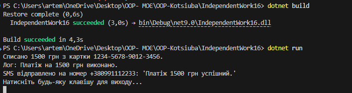

# Самостійна робота №16 — IndependentWork16
---

## 🔹 Опис проєкту
Консольний застосунок на **C#**, який демонструє правильне розділення відповідальностей у класах за принципом **SRP (Single Responsibility Principle)**.  
Мета: зробити код **зрозумілішим, підтримуваним та легко розширюваним**.

---

## 🔹 Поганий приклад (порушення SRP)
Клас `OrderProcessor` виконує відразу кілька завдань:

- перевірка замовлення  
- збереження в базу даних  
- відправка email  

> Один клас виконує забагато функцій, що порушує SRP.

{
public class OrderProcessor
{
    public void Process(Order order)
    {
        Validate(order);
        SaveToDatabase(order);
        SendEmail(order);
    }
}
}
Рефакторинг (дотримання SRP)

## Логіка розділена на окремі класи, кожен із яких відповідає за одну задачу:

IOrderValidator — перевірка замовлення

IOrderRepository — збереження в базу даних

IEmailService — відправка email

OrderService — координує роботу інших класів

public class OrderService
{
    private readonly IOrderValidator _validator;
    private readonly IOrderRepository _repository;
    private readonly IEmailService _emailService;

    public OrderService(IOrderValidator validator, IOrderRepository repository, IEmailService emailService)
    {
        _validator = validator;
        _repository = repository;
        _emailService = emailService;
    }

    public void Process(Order order)
    {
        _validator.Validate(order);
        _repository.Save(order);
        _emailService.Send(order);
    }
} 

Демонстрація роботи

## Висновок

Розділення коду за принципом SRP:

підвищує зрозумілість та підтримуваність

спрощує тестування та модифікацію

робить код більш гнучким завдяки DIP
## UML-діаграма 
