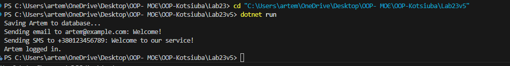

# Лабораторна робота №23

## Тема

ISP & DIP: рефакторинг і Dependency Injection через конструктор

## Мета роботи

Застосувати принципи **розділення інтерфейсу (ISP)** та **інверсії залежностей (DIP)** для рефакторингу коду, а також реалізувати **Dependency Injection через конструктор** для зменшення зв’язаності та покращення тестування.

## Варіант завдання

**Варіант 5 — User Authentication & Notification**  

---

## Початкова структура (порушення ISP та DIP)

У початковому рішенні клас `UserAccountManager`:

* Самостійно створює залежності (`DatabaseConnection`, `SmtpClient`, `SmsGateway`) → порушення **DIP**.  
* Використовує одночасно всі сервіси, навіть якщо потрібна лише частина функціоналу → порушення **ISP**.  

### Приклад коду:

```csharp
class UserAccountManager
{
    private DatabaseConnection db = new DatabaseConnection();
    private SmtpClient smtp = new SmtpClient();
    private SmsGateway sms = new SmsGateway();

    public void RegisterUser(string username, string email, string phone)
    {
        db.SaveUser(username, email, phone);
        smtp.SendEmail(email, "Welcome!", "Your account is created.");
        sms.SendSms(phone, "Welcome to our service!");
    }

    public void LoginUser(string username)
    {
        db.Authenticate(username);
    }
}
Проблеми:

Клас залежить від конкретних реалізацій сервісів (DIP порушення).

Клієнт змушений використовувати всі сервіси, навіть якщо потрібен лише один (ISP порушення).

Рефакторинг (дотримання ISP та DIP)
1. Виділення інтерфейсів
IUserRepository — робота з користувачами у базі.

IEmailService — відправка email.

ISmsService — відправка SMS.

2. Реалізації інтерфейсів
class DatabaseConnection : IUserRepository { ... }
class SmtpClient : IEmailService { ... }
class SmsGateway : ISmsService { ... }
3. Dependency Injection через конструктор
class UserAccountManager
{
    private readonly IUserRepository _userRepository;
    private readonly IEmailService _emailService;
    private readonly ISmsService _smsService;

    public UserAccountManager(IUserRepository userRepository, IEmailService emailService, ISmsService smsService)
    {
        _userRepository = userRepository;
        _emailService = emailService;
        _smsService = smsService;
    }

    public void RegisterUser(string username, string email, string phone)
    {
        _userRepository.SaveUser(username, email, phone);
        _emailService.SendEmail(email, "Welcome!", "Your account is created.");
        _smsService.SendSms(phone, "Welcome to our service!");
    }

    public void LoginUser(string username)
        => _userRepository.Authenticate(username);
}

Демонстрація роботи
Main:
IUserRepository userRepository = new DatabaseConnection();
IEmailService emailService = new SmtpClient();
ISmsService smsService = new SmsGateway();

var manager = new UserAccountManager(userRepository, emailService, smsService);

manager.RegisterUser("Artem", "artem@example.com", "+380123456789");
manager.LoginUser("Artem");
Вивід у консолі:

Saving Artem to database...
Sending email to artem@example.com: Welcome!
Sending SMS to +380123456789: Welcome to our service!
Artem logged in.