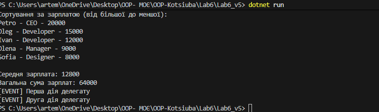

Лабораторна робота №6
Тема
Лямбда-вирази, анонімні функції та делегати у C#

 Мета
Закріпити знання про делегати та події. Навчитись використовувати анонімні методи, лямбда-вирази і вбудовані делегати (Func<>, Action<>, Predicate<>). Отримати практичний досвід застосування лямбда-виразів у колекціях і LINQ-операціях.

 Завдання (варіант №5)
Клас Employee (ім’я, посада, зарплата)
- Створити колекцію працівників
- Застосувати Func<Employee, bool> для вибору працівників із зарплатою >10 000
- Застосувати Action<Employee> для виводу списку в консоль
- Використати LINQ-операції: Where, OrderBy, Aggregate
- Продемонструвати роботу делегатів, лямбда-виразів, анонімних методів

 Демонстрація роботи
Приклад запуску програми у терміналі:
Скріншот запуску
dotnet run

Вивід програми:
Сортування за зарплатою (від більшої до меншої):
Petro - CEO - 20000
Oleg - Developer - 15000
Ivan - Developer - 12000
Elena - Manager - 9000
Sofia - Designer - 8000

Середня зарплата: 12800
Загальна сума зарплат: 64000

[EVENT] Перша дія делегату  
[EVENT] Друга дія делегату

 Теоретичні відомості (коротко)
- Делегати — типи, які зберігають посилання на методи:
delegate int Operation(int x, int y);
- Анонімні методи:
Operation op = delegate(int a, int b) { return a + b; };
- Лямбда-вирази:
Operation op = (a, b) => a + b;
- Стандартні делегати:
- Action<T> — метод без повернення значення
- Func<T, TResult> — метод із результатом
- Predicate<T> — булева перевірка
- Використання в LINQ:
var adults = users.Where(u => u.Age >= 18);

 Хід виконання
- Створити проєкт lab6-v5 у рішенні OOP-Kotsiuba
- Оголосити власний делегат для арифметичних або логічних операцій
- Реалізувати:
- приклади використання анонімних методів
- приклади використання лямбда-виразів
- застосування вбудованих делегатів (Func, Action, Predicate)
- Виконати обробку колекції List<Employee> за допомогою Where, OrderBy, Aggregate
- Продемонструвати виконання у Main() (результати вивести в консоль)
- Створити коміт "Lab6: Lambda & Delegates" і завантажити на GitHub

 Технічні вимоги
- Використати: List, Func<>, Action<>, Predicate<>, LINQ
- Мінімум 2 практичні приклади різних типів делегатів
- Коментарі до ключових частин коду — позначити типи делегатів

 Контрольні запитання
1️ Що таке делегати?
Типи, що зберігають посилання на методи. Дозволяють викликати методи динамічно.
2️ Що таке лямбда-вирази?
Скорочений синтаксис для створення анонімних методів. Зручно використовуються в LINQ.
3️ Які типи стандартних делегатів існують?
- Action<T> — без повернення
- Func<T, TResult> — з результатом
- Predicate<T> — булева перевірка
4️ У чому перевага LINQ?
- Декларативний стиль
- Менше коду
- Зручне фільтрування, сортування, агрегація
5️ Як працюють події та делегати разом?
Події — механізм сповіщення. Делегати — механізм виклику. Разом дозволяють реалізувати реакцію на дії.
