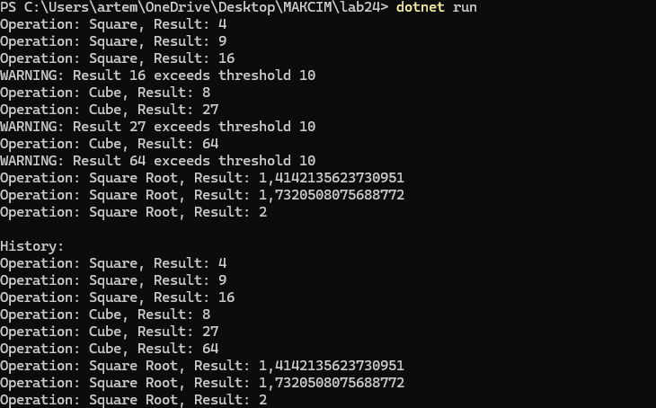

# Лабораторна робота №24  
## Тема: Strategy + Observer: динамічна підстановка алгоритмів + тести

## Мета роботи
Застосувати патерни проєктування Strategy та Observer для створення гнучкої системи обробки числових даних з можливістю:
- динамічної зміни алгоритмів обробки,
- автоматичного сповіщення залежних компонентів про результат,
- розширення функціональності без зміни існуючого коду.

---

## Використані патерни

### 1. Strategy

Патерн Strategy дозволяє інкапсулювати алгоритми в окремі класи та змінювати їх під час виконання програми.

### Інтерфейс:
- `INumericOperationStrategy`
  - `double Execute(double value)`
  - `string OperationName`

### Реалізовані стратегії:
- `SquareOperationStrategy` — квадрат числа
- `CubeOperationStrategy` — куб числа
- `SquareRootOperationStrategy` — квадратний корінь числа

### Контекст:
- `NumericProcessor`
  - Приймає стратегію через конструктор
  - Дозволяє змінювати стратегію через `SetStrategy`
  - Делегує обчислення поточній стратегії

---

### 2. Observer

Патерн Observer реалізовано через події C#.

### Subject:
- `ResultPublisher`
  - Подія: `event Action<double, string> ResultCalculated`
  - Метод: `PublishResult`

### Спостерігачі:
- `ConsoleLoggerObserver` — виводить результат у консоль
- `HistoryLoggerObserver` — зберігає історію обчислень
- `ThresholdNotifierObserver` — повідомляє, якщо результат перевищує поріг

---

## Принцип роботи програми

1. Створюється `NumericProcessor` з початковою стратегією.
2. Створюється `ResultPublisher`.
3. Спостерігачі підписуються на подію `ResultCalculated`.
4. Для кожного числа:
   - Виконується обробка через Strategy.
   - Результат публікується через Observer.
5. Виводиться історія результатів.

---

## Демонстрація

У методі `Main`:
- Використано три різні стратегії.
- Продемонстровано динамічну зміну алгоритмів.
- Показано сповіщення всіх підписників.

---

