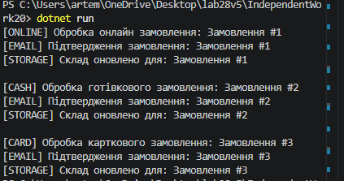

# IndependentWork20

## Варіант 5 — Обробка замовлень

## Використані патерни
- Strategy
- Observer

## Стратегії
- ProcessOnlineOrderStrategy
- ProcessCashOrderStrategy
- ProcessCreditCardOrderStrategy

## Спостерігачі
- OrderConfirmationEmailObserver
- InventoryUpdateObserver

## Висновок
Було реалізовано систему обробки замовлень з можливістю зміни поведінки під час виконання та автоматичним сповіщенням спостерігачів.
