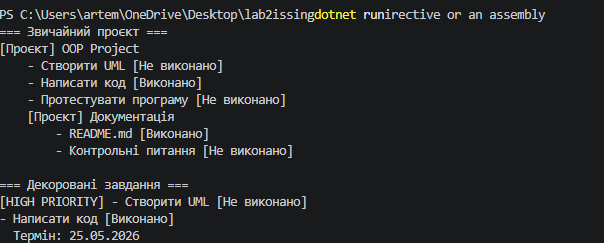

# IndependentWork22

## Тема
Composite + Decorator: реалізація та форматування

## Варіант
5 — Завдання та підзавдання

## Реалізовані патерни

### Composite
- IComponent
- TaskItem
- ProjectTask

### Decorator
- TaskDecorator
- PriorityDecorator
- DueDateDecorator

## Опис роботи
Програма демонструє роботу патернів Composite та Decorator.

Composite дозволяє створювати ієрархію завдань та підзавдань.

Decorator дозволяє динамічно додавати функціональність:
- високий пріоритет;
- термін виконання.



## Запуск

```bash
dotnet run