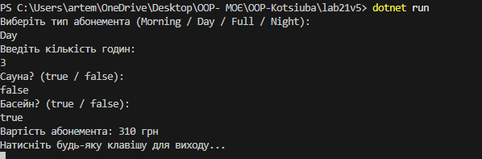

# Lab21v5 — Абонемент у спортзал (OCP + Strategy + Factory)

## Тема
Гнучкі алгоритми розрахунку вартості абонемента у спортзал за допомогою принципу **OCP** та патернів **Strategy** і **Factory Method**.

---

## Мета
- Застосувати принцип відкритості/закритості (OCP)  
- Створити гнучку систему розрахунків  
- Додати нові алгоритми (стратегії) без зміни існуючого коду

---

## Використані патерни
- **Strategy** — кожен тип абонемента реалізує інтерфейс `IGymPassStrategy`  
- **Factory Method** — клас `GymPassStrategyFactory` створює потрібну стратегію  
- **Контекст** — `GymService` працює тільки через інтерфейс, не знає конкретних класів

---

## Реалізовані стратегії
1. MorningPass  
2. DayPass  
3. FullPass  
4. NightPass (демонстрація OCP — нова стратегія додана без зміни GymService)

---

## Запуск програми
1. Відкрити проєкт `lab21v5` у **Visual Studio** або іншому C# IDE  
2. Запустити `Program.cs`  
3. Ввести в консоль:
   - Тип абонемента (`Morning`, `Day`, `Full`, `Night`)  
   - Кількість годин  
   - Додаткові послуги (`sauna`, `pool`) — `true` або `false`  
4. Програма виведе **вартість абонемента**

